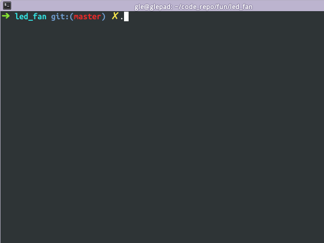

# led_fan

[](https://travis-ci.org/hmgle/led_fan)

无需花钱买硬件, led_fan 让你在软件上拥有一个闪烁的 [LED 风扇(摇摇棒)](https://www.google.com/search?q=led+风扇&tbm=isch)



依赖的库:
- SDL2
- SDL2_gfx

Debian/Ubuntu 可执行下面命令安装依赖库:

```
sudo apt-get install libsdl2-dev libsdl2-gfx-dev
```

## 编译及运行

```
make
./led_fan "需要显示的字符"
# 按任意键终止
./led_fan # 不带参数时跑一个彩虹猫~
```
